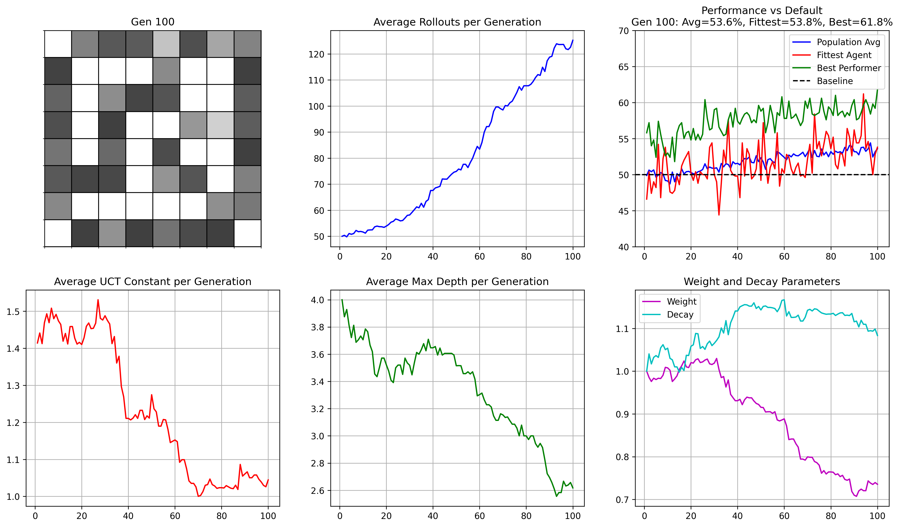

# Game of Life for Feature Evolution (GOLF evolution)
Evolving MCTS Agent Parameters
[Download or view the simulation video](GOLF.mp4)  
**Author:** Nate Ly  
## Running Program
```bash
python3 life.py
```
**OR**
```bash
make
./GOLF
```
**Output**

For each generation average constants and performance is printed in terminal and saved in .cvs files which can later be graphed
```
python3 plot.py
```

Live game grid and graphs tracking constants shown using Matplotlib 
## The Question  
Using a game of life simulation-ish simulation, can we evolve a population to play the game better?  

## Motivation  

Using a model similar to Conway's Game of Life, where each cell is an agent that plays the game differently, we want to see how the population evolves over time.  

Incorporating some elements from genetic algorithms and reinforcement learning, we can see if we can nudge the population into tuning for evolving for better parameters  

## Agents as MCTS Players  

Each cell is a MCTS agent with the following parameters:

- **Exploration Constant (C):** Balances exploration vs. exploitation.  
- **Number of Rollouts per Move:** How many simulations each agent runs per decision.  
- **Rollout Depth:** Maximum depth of each simulation.  
- **Backpropagation Weights:** How simulation results are propagated through the tree.  
- **Backpropagation Decay:** How simulation results are discounted through the tree.  

### 1. Competition Phase  

- Agents play cribbage pegging games against their neighbors, using their MCTS parameters to choose next moves  
- After N games the average margin is calculated  
- Agents gain or lose fitness points based on game margin  

### 2. Elimination Phase  

- Fitness of all cells is decayed to discourage stagant and old strategies  
- Cells with fitness below 0 are killed  

### 3. Birth Phase  

- Following the standard revival rule (dead cell with three live neighbours), new agents are born.  
- New agents adopt parameters from the currently alive cells who are the genetic pool  
  - With probability e, copy parameters from neighbor with highest fitness  
  - With probability 1−e, copy parameters from the best performing agent  
- Parameters are then mutated upon birth to introduce variation among the population  

### Initial Pameters  
- Game Parameters (chosen as to not blow my computer up)
  - Number of generations simulated = 100
  - Time Limit = 0.005s
  - Number of games per mach = 250
  - Grid Size = 8  
  - Initial Grid Density = 0.5  
  - Number of Games for each matchup = 250  
  - Fitness Decay with each Generation = 0  
  - Epsilon = 0.1  
  - Max Mutation Percent = 0.15  
- Agent Parameters
  - UCT Constant = sqrt(2)
  - Rollouts = 50  
  - Max search depth = 4  
  - BP weight = 1
  - BP decay = 1

## Performance Tracking  
At the end of each generation we collect:  
- Average MCTS Parameters  
- Population mean win rate against original agent  
- Fiittest agent's win rate  
- Best performer's win rate  

This is stored in simulation_data folder

## Results


Simulating for 100 generations and extracted from the CSV, the final population had:

- Average Agent Parameters
  - UCT Constant = 1.044465166456834
  - Rollouts = 125.23529411764706
  - Max search depth = 2.6176470588235294
  - BP weight = 0.7355062877045861
  - BP decay = 1.0833588282288886

A comparison over 100,000 games for consistency in compare.py shows

Population Mean vs Default Agent
Net score: 0.1654
Winrate : 54.515%

Default Agent vs Minimax 
Net score: -0.3326
Winrate : 43.645%

Population Mean vs Minimax
Net score: -0.2222
Wins: 46.96%

## Results
By running a cellular evolution simulation on MCTS Agents, we were able to evolve a population based on the defaul agent that performs better against a full Minimax search than the default by a 3.315% winrate and 0.1104 point margin

